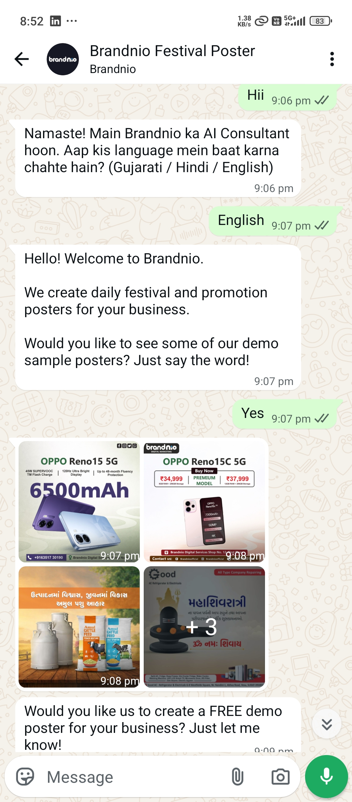
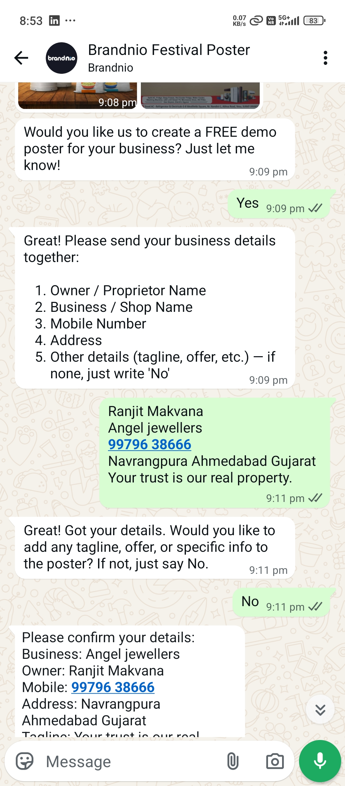
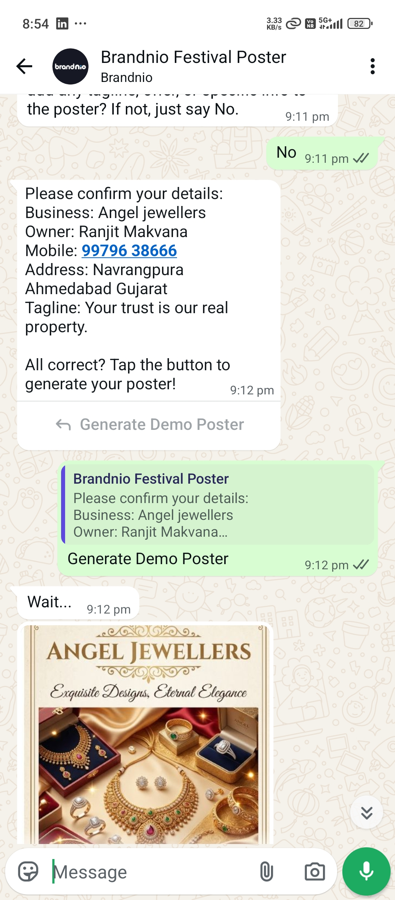

# 🤖 Brandnio AI: WhatsApp-to-Gemini Automation Agency Bot

## 📌 Project Overview
This project is a fully automated, end-to-end **"AI Creative Agency in a Bot."** It acts as a digital sales consultant that interacts with customers via WhatsApp, gathers their business details, and uses a highly resilient backend pipeline to generate hyper-personalized promotional posters using Google's Gemini AI. The final branded artwork is delivered straight to the customer's WhatsApp in under a minute.

### The Live User Experience (Visual Walkthrough)

| 1. Onboarding & Menu | 2. Gathers Business Details | 3. Instantly Delivers HD Poster |
| :--- | :--- | :--- |
|  |  |  |

Built to demonstrate advanced state-machine logic, Meta API webhook handling, and resilient AI integrations, this project guarantees flawless execution through a custom-built dual-engine architecture.

---

## 🧠 The Dual-Engine Image Generation Architecture
Relying on a single point of failure is dangerous in production. This bot implements a proprietary **Dual-Engine Pipeline** to ensure 100% uptime and the highest quality image generation:

### Engine A: Official Gemini API (Imagen 4.0)
* **Role:** The primary, high-speed generator.
* **Logic:** Uses the official `google-genai` SDK to fetch breathtaking, textless architectural/scene backgrounds based on the user's business category (e.g., Real Estate). Lightning-fast, stable, and highly scalable.

### Engine B: Playwright Browser Automation (The Smart Fallback)
* **Role:** The fail-safe UI scraper.
* **Logic:** If the official API hits a rate limit (`429 RESOURCE_EXHAUSTED`), the system seamlessly falls back to a headless Chromium browser. It navigates the Gemini web interface, injects the prompt, clicks the generated thumbnail to open the high-res modal, and extracts the direct `src` binary—completely bypassing UI artifacts.

---

## 🚧 Engineering Challenges & Architectural Solutions

### 1. The Typography Hallucination (AI Text Issue)
* **Problem:** Native AI image models struggle to draw complex regional scripts and often misspell business names on posters.
* **Solution:** Separated the design from the text. The AI engines generate a pristine *blank* background. A custom Python rendering engine (using Pillow / Playwright HTML overlays) then mathematically calculates the grid and prints the business details in perfect multi-lingual fonts (English, Hindi, or Gujarati) over the AI image. **0% spelling mistakes.**

**Proof of Output Quality (AI Background + Flawless Typography Overlay):**


### 2. The Playwright Concurrency Crash
* **Problem:** Multiple WhatsApp users requesting posters simultaneously caused the Flask server to open competing Chromium instances on the same user-data directory, crashing the application.
* **Solution:** Implemented a thread-safe `queue.Queue()` and background worker daemon. Meta webhooks are acknowledged instantly (`200 OK`) to prevent timeouts, while poster generation tasks are processed serially in the background.

### 3. Google CDN "403 Forbidden" Blocks
* **Problem:** Direct download attempts of generated images via scraped URLs were blocked by Google's CDN.
* **Solution:** Engineered a robust DOM-specific extraction method. The script locates the exact high-res `` element inside the modal viewer and uses `page.request.get(src)` with authenticated session cookies to bypass the CDN block entirely.

### 4. Conversation State Management
* **Problem:** Users sending out-of-order messages or frustrated queries broke the rigid keyword-based flow.
* **Solution:** Built a **Hybrid LLM Gatekeeper**. Every incoming WhatsApp message is intercepted by Gemini 2.5 Flash, which returns a strict JSON schema identifying the user's exact intent (`YES`, `NO`, `DETAILS_PROVIDED`, `QUESTION`). If the user asks an off-topic question, the AI handles it conversationally without breaking the underlying Finite State Machine (FSM).

---

## 🏗️ System Architecture: How It Works
1.  **Multi-Lingual Onboarding:** The bot greets the user and dynamically adapts to Gujarati, Hindi, or English based on user preference.
2.  **Smart Sales Funnel:** A state-machine-driven conversational flow interactively collects business details (Name, Number, Address, Tagline).
3.  **Hybrid Prompt Injection:** User details are mapped to an optimized master dictionary of 85+ photorealistic scene descriptions.
4.  **Dual-Engine Generation:** The system passes the prompt to Engine A (API) or Engine B (Playwright) to secure the blank visual asset.
5.  **Typography Overlay:** The custom Python engine injects flawless text layers (Contact info, Branding) onto the generated AI background.
6.  **WhatsApp Delivery & Monetization:** The final HD asset is delivered via Meta Cloud API, followed by an automated ₹499/year subscription pitch and a UPI QR code for payment.

---

## 💻 Tech Stack & Tools
* **Backend:** Python, Flask
* **AI Models:** Google Gemini 2.5 Flash (Intent parsing), Imagen 4.0 API (Image generation)
* **Browser Automation:** Playwright (Sync API)
* **Graphics Rendering:** Pillow (PIL), HTML/CSS DOM manipulation
* **Integrations:** Meta WhatsApp Cloud API Webhooks
* **AI Coding Assistant:** Claude Code (Utilized for architectural guidance, rapid refactoring, and complex Playwright logic optimization)
* **Security:** Environment variables (`python-dotenv`) for strict API key and token masking.

---

## 🛡️ Security & Installation
This repository does not contain sensitive API keys or client data.
To run this project locally, clone the repository and create a `.env` file in the root directory with the following variables:
```env
WHATSAPP_TOKEN=your_meta_bearer_token
PHONE_NUMBER_ID=your_whatsapp_phone_id
VERIFY_TOKEN=your_custom_webhook_secret
GEMINI_API_KEY=your_google_ai_studio_key
