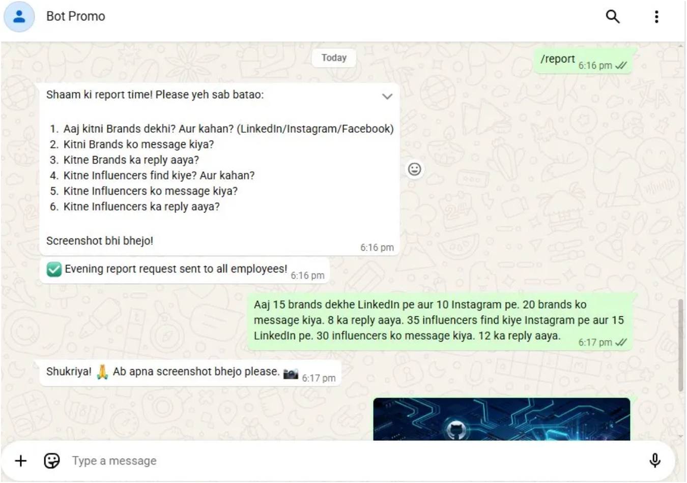
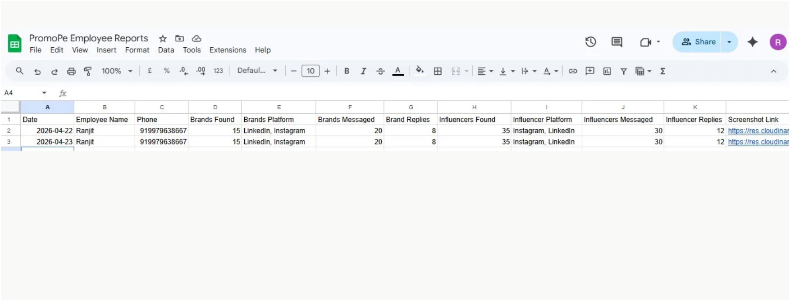

# # WhatsApp Employee Automation System

A WhatsApp-based employee task management and daily reporting bot for **PromoPe**, a talent/influencer marketing company. It automates the daily grind of assigning tasks, collecting end-of-day reports, and archiving proof-of-work screenshots — all through a conversation employees already use every day: WhatsApp.

---

## What It Does

Every workday, the bot:

1. **Assigns morning tasks** to each employee over WhatsApp (find brands/influencers on LinkedIn, Instagram, Facebook, and reach out to them).
2. **Sends a midday check-in** to keep employees on track.
3. **Collects an evening report** — a structured set of questions about brands/influencers found, messaged, and replied to.
4. **Accepts a screenshot** as proof of the day's outreach, uploads it to Cloudinary, and stores the link alongside the report.
5. **Uses AI to parse free-form report text** (casual Hindi/English/mixed) into clean structured fields.
6. **Logs everything to Google Sheets**, giving the manager a live, always-up-to-date dashboard.
7. **Lets the manager broadcast messages and pull status** directly from WhatsApp using simple slash commands.

No app to install, no dashboard to log into — employees just chat with a WhatsApp number.

---

## Tech Stack

| Layer                  | Technology                          |
|-------------------------|--------------------------------------|
| Backend                | Python, Flask                        |
| Messaging              | Meta WhatsApp Cloud API              |
| Data Storage           | Google Sheets (via `gspread`)        |
| AI Parsing             | OpenAI (`gpt-4o-mini`)               |
| Image Hosting          | Cloudinary                           |
| Scheduling             | APScheduler (cron-style daily jobs)  |

---

## Key Features

- **🌅 Morning Task Assignment** — automated daily kickoff message with the day's goals, sent to every employee on a schedule.
- **🕐 Midday Check-In** — a lightweight nudge to keep momentum going through the day.
- **🌆 Evening Report Collection** — a conversational, step-based flow (`idle → evening_started → waiting_screenshot → done`) that walks each employee through submitting their report.
- **📸 Screenshot Handling via Cloudinary** — proof-of-work images are downloaded from WhatsApp, uploaded to Cloudinary, and the public URL is stored with the report — no local file storage needed.
- **🧠 AI-Powered Report Parsing** — employees report in natural, mixed Hindi/English language; OpenAI extracts it into 8 standardized fields (brands found/messaged/replied, influencers found/messaged/replied, and platforms).
- **📋 Google Sheets Logging** — every report becomes a new row: employee name, phone, parsed metrics, screenshot link, and timestamp.
- **📢 Manager Broadcast Commands** — the manager's WhatsApp number gets special privileges:
  - `/broadcast <message>` — send a message to every employee at once
  - `/status` — see each employee's current step in the report flow
  - `/report` — manually trigger the evening report request for everyone

---

## Architecture Flow

```
                            ┌──────────────────────────┐
                            │   APScheduler (IST)      │
                            │  10:00 → Morning tasks   │
                            │  12:30 → Midday check-in │
                            │  18:00 → Evening report  │
                            └────────────┬─────────────┘
                                         │
                                         ▼
┌─────────────┐   outbound msgs   ┌─────────────────┐   inbound msgs   ┌─────────────┐
│  Employees   │ ◄──────────────── │  Flask Webhook   │ ◄──────────────── │  Employees   │
│  (WhatsApp)  │                   │  /webhook (GET/  │                   │  (WhatsApp)  │
└─────────────┘                   │      POST)       │                   └─────────────┘
                                   └────────┬─────────┘
                                            │
                     ┌──────────────────────┼───────────────────────┐
                     ▼                      ▼                       ▼
             ┌───────────────┐     ┌────────────────┐      ┌────────────────┐
             │ Manager Cmds   │     │  Report Text    │      │  Screenshot    │
             │ /broadcast     │     │  (step tracking  │      │  (image msg)   │
             │ /status        │     │   via state.py)  │      │                │
             │ /report        │     └────────┬───────┘      └───────┬────────┘
             └───────────────┘              │                       │
                                             ▼                       ▼
                                    ┌─────────────────┐    ┌───────────────────┐
                                    │  OpenAI parses   │    │  Cloudinary upload │
                                    │  raw text into   │    │  → public image URL│
                                    │  structured JSON │    └─────────┬─────────┘
                                    └────────┬─────────┘              │
                                             └───────────┬────────────┘
                                                         ▼
                                              ┌────────────────────┐
                                              │   Google Sheets     │
                                              │  (final report row) │
                                              └────────────────────┘
```

---

## Project Structure

```
promope-bot/
├── main.py               # Flask app entrypoint, starts scheduler + webhook
├── webhook.py            # /webhook routes — message routing & conversation logic
├── scheduler.py          # APScheduler cron jobs (morning/midday/evening)
├── whatsapp.py           # WhatsApp Cloud API send/receive helpers
├── openai_helper.py      # AI-powered report text → structured JSON parsing
├── cloudinary_upload.py  # Screenshot upload to Cloudinary
├── sheets.py             # Google Sheets read/write helpers
├── state.py              # Per-employee conversation step tracking
├── config.py             # Environment variables & employee registry
├── requirements.txt      # Python dependencies
├── screenshots/          # Demo images for documentation
├── .env.example          # Template for required environment variables
└── .gitignore
```

---

## Setup Instructions

### 1. Clone & install dependencies

```bash
git clone <repository-url>
cd promope-bot
python -m venv venv
source venv/bin/activate    # On Windows: venv\Scripts\activate
pip install -r requirements.txt
```

### 2. Configure environment variables

Copy the example file and fill in your own credentials:

```bash
cp .env.example .env
```

| Variable                    | Description                                              |
|-----------------------------|------------------------------------------------------------|
| `WHATSAPP_TOKEN`            | Access token from your Meta App (WhatsApp Cloud API)       |
| `WHATSAPP_PHONE_NUMBER_ID`  | Phone Number ID from Meta's WhatsApp Business setup         |
| `VERIFY_TOKEN`               | Any string you choose; used to verify the webhook with Meta |
| `OPENAI_API_KEY`            | API key from your OpenAI account                            |
| `GOOGLE_SHEET_ID`           | ID of the Google Sheet used to store reports                |
| `MANAGER_PHONE`             | Manager's WhatsApp number (international format, no `+`)    |
| `GOOGLE_DRIVE_FOLDER_ID`    | (Optional) Drive folder for backups/exports                  |
| `CLOUDINARY_CLOUD_NAME`     | Cloudinary account cloud name                                |
| `CLOUDINARY_API_KEY`        | Cloudinary API key                                           |
| `CLOUDINARY_API_SECRET`     | Cloudinary API secret                                        |

### 3. Set up Google Sheets access

- Create a Google Cloud service account with access to the Sheets API.
- Download its JSON key and save it as `service_account.json` in the project root.
- Share your target Google Sheet with the service account's email address.

### 4. Register employees

Edit the `EMPLOYEES` list in `config.py` with each employee's name and WhatsApp phone number (international format, no `+`).

### 5. Configure the Meta webhook

- Deploy the app (or expose it locally with a tunnel like `ngrok`).
- In the Meta App dashboard, set the webhook URL to `https://<your-domain>/webhook`.
- Use the same value as `VERIFY_TOKEN` for Meta's verification step.
- Subscribe to the `messages` field.

### 6. Run the bot

```bash
python main.py
```

The Flask server starts on port `5000`, the header row is verified in Google Sheets, and the daily scheduler (morning/midday/evening jobs, IST) begins running in the background.

---

## Demo Screenshots

**WhatsApp Conversation Flow** — the bot asking evening report questions and the employee replying



**Google Sheet Report Log** — saved report data, including the Screenshot Link column



---

## License

This project was built as an internal tool for PromoPe. Adapt freely for similar employee-reporting workflows.
